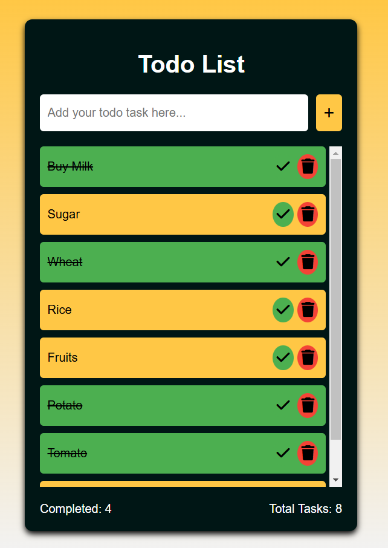

# Todo List Application

This is a simple Todo List application built using **Spring Boot** for the backend and basic **HTML**, **CSS**, and **JavaScript** for the frontend. It uses **MongoDB** for the database. It allows users to add, complete, and delete tasks from a todo list.

## Prerequisites

Before you begin, ensure you have the following installed:

1. **Java 17+** (For running the Spring Boot application)
   - You can check if Java is installed by running: `java -version` in your terminal.
   - Download and install from [Oracle's official website](https://www.oracle.com/java/technologies/javase/jdk17-archive-downloads.html) and then set up environment variables.

2. **Maven** (For building and managing the Spring Boot application)
   - You can check if Maven is installed by running: `mvn -v` in your terminal.
   - Download and install from [Maven's official website](https://maven.apache.org/download.cgi) and then set up environment variables.

3. **IDE** (Recommended: Visual Studio Code or IntelliJ IDEA)
   - Install [Visual Studio Code](https://code.visualstudio.com/) or [IntelliJ IDEA](https://www.jetbrains.com/idea/) for an integrated development experience.

4. **Git** (For cloning the repository)
   - You can check if Git is installed by running: `git --version` in your terminal.
   - Download and install from [Git's official website](https://git-scm.com/).

5. **MongoDB** (For database)
   - You can check if MongoDB is installed by running: `mongod --version` in your terminal.
   - Download MongoDB from [MongoDB Download Center](https://www.mongodb.com/try/download/community).
   - Download MongoDB Compass (GUI for MongoDB) from [MongoDB Compass Download Page](https://www.mongodb.com/try/download/community) and install it on your system.
   - Open MongoDB Compass and connect to your local MongoDB instance at `mongodb://localhost:27017` (default port).

## Steps to Clone and Run the Project
Follow the steps below to clone and run the project on your local machine:

#### 1. Clone the Repository
- Clone the project using Git by running the following command in your terminal:
    ```
    git clone https://github.com/keerthisureka/Quinbay.git
    ```
- This will create a local copy of the repository on your machine.

#### 2. Navigate to the Project Directory
- Navigate into the cloned project directory:
    ```
    cd '.\Main Project-Phase 2\todo\'
    ```

#### 3. Open the Project in VS Code (or any other IDE)
- If you're using Visual Studio Code, open the project by running: `code .`
- If you're using IntelliJ IDEA, open the project through the "Open" menu option and select the project directory.

#### 4. Modify the `application.properties` File for MongoDB
- In your project, navigate to `src/main/resources/application.properties` and modify the following MongoDB configuration as per your database name:
    ```
    spring.data.mongodb.uri=mongodb://localhost:27017/todo_db
    ```
- **Note:** If you are using MongoDB Atlas, replace localhost with your Atlas connection string (found in your Atlas dashboard).

#### 5. Build and Run the Application
- **Using VS Code or Command Line:** Open Terminal in your IDE (or use the system terminal) and run the following command to build and run the Spring Boot application:
    ```
    mvn spring-boot:run
    ```
- The default port is 8080. You can access the application by opening your browser and going to: [http://localhost:8080](http://localhost:8080)

#### 6. MongoDB Verification with MongoDB Compass
- Once your application is running, you can open MongoDB Compass and connect to `mongodb://localhost:27017` to check if the `todo_db` database is created, and you should see the documents associated with your todo tasks under the collection named as `tasks`.

#### 7. Project Structure
```
todo/
├── src/
│   ├── main/
│   │   ├── java/
│   │   │   └── com/
│   │   │       └── example/
│   │   │           └── todo/
│   │   │               |── controller/
│   │   │               |   └── TaskController.java     # Manages the todo list actions (add, delete, update)
│   │   │               |── model/
│   │   │               |   └── Task.java               # A model class that represents the `Task` entity (e.g., task name)
│   │   │               |── repository/
│   │   │               |   └── TaskRepository.java     # The repository interface that extends Spring Data JPA to manage `Task` entities in the database.
│   │   │               |── TodoApplication.java        # Main Spring Boot Application class
│   │   ├── resources/
│   │   │   ├── static/                                 # Contains the frontend assets such as HTML, CSS, and JavaScript files.
│   │   │   │   ├── index.html                          # Frontend HTML file
│   │   │   │   ├── script.js                           # Javascript file for interaction with database
│   │   │   │   ├── style.css                           # Custom CSS file for styling
│   │   │   ├── application.properties                  # Configuration file for Spring Boot (e.g., database settings, server port, etc.).
├── pom.xml  # Maven configuration file
```

## Dependencies Used
- Spring Web
- Spring Boot DevTools (optional, for hot reloading during development)
- Spring Data MongoDB (for MongoDB integration)
- Lombok (optional, simplifies code, like getters/setters)
- *Added by default:* Spring Boot Starter Test (for unit testing)

## Features
- Add tasks to the todo list.
- Mark tasks as completed.
- Delete tasks from the list.
- View total tasks and completed tasks.

## Troubleshooting
#### 1. Issues with static files not reflecting
If the changes in your CSS or HTML files are not reflecting:
- Make sure the static files are placed in `src/main/resources/static/`.
- Clear your browser cache or try opening the page in Incognito/Private mode.
- Perform a hard refresh by pressing `Ctrl + F5` or `Cmd + Shift + R` in your browser.

#### 2. Application not starting
If the Spring Boot application doesn't start properly:
- Ensure Java 17 and Maven are installed correctly.
- Check the terminal for any errors or missing dependencies.
- You can run `mvn clean install` to clean the project and reinstall dependencies before running the app again.

## Screenshot of the Application
Here is a screenshot of the Todo List application running:
